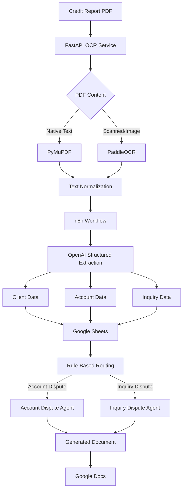

# Credit Report Analysis & Dispute Automation Platform

> AI-powered document automation platform for extracting structured data from credit-report PDFs, identifying dispute candidates, and generating personalized dispute documents.

## Overview

This project automates a credit-report document workflow from PDF ingestion to structured data extraction and document generation.

The platform combines:

* **FastAPI** for the document-processing API
* **PyMuPDF** for native PDF text extraction
* **PaddleOCR** for scanned/image-based PDFs
* **OpenAI** for structured information extraction and document generation
* **n8n** for workflow orchestration and business-rule routing
* **Google Sheets** for structured data management
* **Google Docs** for editable document generation

### Workflow

```text
Credit Report PDF
        │
        ▼
   FastAPI Service
        │
        ▼
 PDF Text / OCR
        │
        ▼
 Structured AI Extraction
        │
        ▼
 Google Sheets
        │
        ▼
 Rule-Based Routing
     ┌──┴──┐
     ▼     ▼
 Account  Inquiry
 Dispute  Dispute
     │     │
     └──┬──┘
        ▼
 AI Document Generation
        │
        ▼
    Google Docs
```

## Key Features

### Hybrid PDF Processing

Supports both native and scanned PDFs.

```text
PDF
 │
 ├── Native text → PyMuPDF
 │
 └── Scanned page → PaddleOCR
                       │
                       ▼
                 Normalized Text
```

This avoids unnecessary OCR processing when usable native text is already available.

### Structured AI Extraction

Unstructured credit-report text is transformed into structured data for downstream automation.

Example data categories:

* Client information
* Credit accounts
* Negative accounts
* Hard inquiries
* Account status
* Balances
* Dates
* Relevant report metadata

### Automated Dispute Routing

The workflow uses n8n rule-based routing to separate different dispute categories.

```text
Extracted Data
      │
      ▼
  Rule Engine
   ┌──┴──┐
   ▼     ▼
Account Inquiry
Dispute  Dispute
```

The architecture can be extended with additional dispute categories without changing the core OCR service.

### AI-Powered Document Generation

Structured data is combined with dispute context and bureau information to generate personalized documents.

Supported bureaus:

* Experian
* Equifax
* TransUnion

Generated documents can be transferred to Google Docs for human review and editing.

## Architecture



## Tech Stack

| Layer                 | Technology               |
| --------------------- | ------------------------ |
| Language              | Python                   |
| API                   | FastAPI                  |
| ASGI Server           | Uvicorn                  |
| PDF Processing        | PyMuPDF                  |
| OCR                   | PaddleOCR / PaddlePaddle |
| AI                    | OpenAI                   |
| Workflow Automation   | n8n                      |
| Structured Data       | Google Sheets            |
| Documents             | Google Docs              |
| Storage / Files       | Google Drive             |
| Dependency Management | uv                       |

## Project Structure

The Python service follows a `src`-based package layout:

```text
.
├── src/
│   └── pdf_ocr_api/
│       ├── __init__.py
│       └── main.py
│
├── pyproject.toml
├── README.md
├── LICENSE
├── .gitignore
└── .python-version
```

Workflow definitions and infrastructure-related files can be maintained separately as the automation layer grows.

## Requirements

* Python `3.13+`
* [uv](https://docs.astral.sh/uv/)
* OpenAI API access
* Google Workspace API credentials
* n8n instance

## Installation

Clone the repository and enter the project directory:

```bash
git clone <repository-url>
cd Smart-Credit-Dispute-Inquiry-Automation-System
```

Create the environment and install dependencies:

```bash
uv sync
```

Activate the virtual environment if required:

### Windows PowerShell

```powershell
.venv\Scripts\Activate.ps1
```

### Linux / macOS

```bash
source .venv/bin/activate
```

## Environment Variables

Create a `.env` file for local development:

```env
OPENAI_API_KEY=your_openai_api_key
```

Additional Google and n8n configuration should be provided through secure environment variables or their respective credential-management systems.

> Never commit API keys, OAuth credentials, credit-report PDFs, or other sensitive information to the repository.

## Running the API

Start the FastAPI application with:

```bash
uv run uvicorn pdf_ocr_api.main:app --reload --host 0.0.0.0 --port 8000
```

The API will be available at:

```text
http://localhost:8000
```

FastAPI interactive documentation:

```text
http://localhost:8000/docs
```

## API

### `POST /ocr`

Processes an uploaded credit-report PDF and returns extracted text and processing metadata.

#### Request

```http
POST /ocr
Content-Type: multipart/form-data
```

Example using `curl`:

```bash
curl -X POST "http://localhost:8000/ocr" \
  -F "file=@credit_report.pdf"
```

#### Example Response

```json
{
  "success": true,
  "filename": "credit_report.pdf",
  "total_pages": 1,
  "processing_time_seconds": 1.45,
  "pages": [
    {
      "page": 1,
      "text": "Extracted report text...",
      "native_items": 45,
      "ocr_items": 12,
      "time_seconds": 1.42
    }
  ],
  "text": "Extracted report text..."
}
```

> Response fields may change as the API evolves.

## Security & Privacy

Credit reports contain sensitive personal and financial information. Production deployments should implement appropriate security controls.

Recommended controls include:

* Do not store unnecessary PII
* Mask sensitive identifiers where possible
* Keep API keys outside source control
* Use secure credential storage
* Enforce HTTPS in production
* Authenticate the OCR API
* Validate uploaded files
* Apply request-size limits
* Restrict public network access
* Maintain audit logs
* Implement appropriate retention and deletion policies

For production use, human review and compliance validation should remain part of the workflow where required.

## Engineering Highlights

This project demonstrates:

* Hybrid native-PDF and OCR processing
* AI-based structured information extraction
* Modular document-processing architecture
* Workflow orchestration with n8n
* Rule-based business routing
* API integration with external services
* Automated document generation
* Human-in-the-loop review
* PII-aware system design

## Scalability

The system is designed around independent components:

```text
                 ┌── PDF/OCR Service
                 │
                 ├── AI Extraction
                 │
n8n Workflow ────┼── Google Sheets
                 │
                 ├── Business Rules
                 │
                 └── Document Generation
```

This allows individual components to evolve independently.

Potential scaling strategies include:

* Queue-based document processing
* Batch PDF processing
* Async job execution
* OCR service scaling
* Retry and failure handling
* Processing status tracking
* Centralized logging
* Monitoring and metrics
* Human-review workflows

## Roadmap

* [ ] OCR confidence scoring
* [ ] Structured extraction validation
* [ ] Human-review dashboard
* [ ] Duplicate detection
* [ ] Workflow retry and recovery
* [ ] Audit logging
* [ ] Role-based access control
* [ ] Batch document processing
* [ ] Production monitoring
* [ ] Automated quality checks
* [ ] Processing and accuracy metrics

## Project Value

The platform transforms a repetitive document workflow into a structured automation pipeline:

```text
Unstructured PDF
      ↓
Document Intelligence
      ↓
Structured Data
      ↓
Business Rules
      ↓
AI Generation
      ↓
Editable Documents
      ↓
Human Review
```

The primary objective is to reduce repetitive document-processing work while keeping validation and approval within the appropriate human workflow.

## Resume Summary

> Built an AI-powered credit-report document automation platform using Python, FastAPI, PyMuPDF, PaddleOCR, OpenAI, n8n, and Google Workspace APIs to automate PDF/OCR processing, structured data extraction, dispute classification, and document generation.

## License

This project is licensed under the terms specified in [`LICENSE`](LICENSE).
