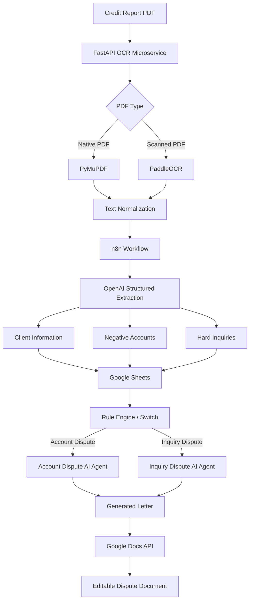

# 🚀 Credit Report Analysis & Dispute Automation Platform

> **An end-to-end AI-powered document automation system that transforms complex credit report PDFs into structured data, intelligently identifies dispute candidates, and generates personalized FCRA-based dispute letters with minimal manual intervention.**

---

## 📌 Project Overview

Credit reports are often delivered as long, complex PDF documents containing hundreds of lines of account information, payment history, personal information, and hard inquiries.

Traditionally, analyzing these reports requires manually:

* Opening and reviewing large PDF documents
* Reading both native and scanned pages
* Identifying negative accounts
* Finding potentially unauthorized hard inquiries
* Extracting account details
* Organizing information into spreadsheets
* Preparing separate dispute letters
* Formatting those letters for different credit bureaus
* Creating and managing documents for further review

This project automates that entire workflow using **AI, OCR, document processing, workflow automation, and Google Workspace integrations**.

### 🎯 Core Goal

Build a production-oriented automation pipeline that can:

**PDF → OCR → Text Extraction → AI Analysis → Structured Data → Rule-Based Routing → AI Letter Generation → Google Docs**

---

# 💡 Problems Solved

## 1. Manual Credit Report Review

### Problem

Credit reports can contain a large amount of unstructured information. Manually reviewing every page is repetitive, time-consuming, and prone to human error.

### Solution

Built a hybrid document-processing pipeline using:

* PyMuPDF
* PaddleOCR
* OpenCV
* FastAPI
* OpenAI models

The system automatically extracts text from both:

* Native/text-based PDFs
* Scanned/image-based PDFs

### Impact

Instead of requiring a user to manually read the entire document, the system converts the report into machine-readable text that can be analyzed automatically.

**Expected benefit:** significantly reduces repetitive document-review work and allows human reviewers to focus on validation and decision-making instead of data extraction.

---

# 2. Native + Scanned PDF Compatibility

### Problem

Traditional PDF text extraction tools often fail when documents are scanned images.

A credit report may contain a mixture of:

* Native PDF text
* Scanned pages
* Embedded images
* Different layouts
* OCR-sensitive characters

### Solution

Implemented a **Hybrid PDF Processing Pipeline**.

```text
PDF
 │
 ├── Native Text Detection
 │        ↓
 │   PyMuPDF Extraction
 │
 └── Scanned/Image Detection
          ↓
       PaddleOCR
          ↓
      Text Cleanup
          ↓
     Deduplicated Output
```

The system intelligently combines native PDF extraction with OCR instead of relying exclusively on OCR.

### Impact

This approach helps:

* Preserve native text when available
* Recover text from scanned pages
* Reduce unnecessary OCR processing
* Improve extraction reliability
* Minimize character loss and duplicate text

---

# 3. Manual Data Entry into Spreadsheets

### Problem

After reviewing a credit report, users often need to manually copy information into spreadsheets.

Typical fields include:

* Client information
* Account names
* Account numbers
* Reported balances
* Account status
* Dates
* Payment history
* Negative items
* Hard inquiries

This creates unnecessary repetitive work and increases the possibility of transcription errors.

### Solution

Used structured AI extraction to transform unstructured credit-report text into normalized data.

### Example

```text
Raw PDF Text
      ↓
OpenAI Structured Extraction
      ↓
Normalized JSON
      ↓
Google Sheets
```

### Automated Data Categories

#### Client Information

* Name
* Address
* Date of birth
* Report metadata
* Other relevant identifiers

#### Negative Accounts

* Creditor
* Account number
* Account status
* Balance
* Date opened
* Payment information
* Negative status
* Relevant report details

#### Hard Inquiries

* Company
* Inquiry date
* Inquiry type
* Relevant metadata

### Impact

Eliminates much of the repetitive copy/paste process and creates a standardized dataset for downstream automation.

---

# 4. Intelligent Dispute Classification

### Problem

Different types of credit-report issues may require different workflows.

For example:

* Account-related disputes
* Hard-inquiry disputes

Manually deciding which workflow should process each case creates additional operational overhead.

### Solution

Implemented an automated routing layer using **n8n Switch/Rule Nodes**.

```text
                    ┌── Account Dispute ──→ Account AI Agent
                    │
Extracted Data ─────┤
                    │
                    └── Inquiry Dispute ─→ Inquiry AI Agent
```

The system dynamically routes records according to dispute type.

### Impact

* Removes unnecessary manual routing
* Creates consistent processing logic
* Makes the workflow easier to scale
* Separates different AI generation tasks
* Makes future dispute categories easier to add

---

# 5. Manual Dispute Letter Creation

### Problem

Preparing dispute letters manually can involve:

* Finding the correct account details
* Copying information from spreadsheets
* Selecting the correct credit bureau
* Writing the dispute explanation
* Formatting the letter
* Creating a document
* Repeating the process for multiple items

This is highly repetitive.

### Solution

Built AI-powered dispute letter generation using structured extracted data.

The system automatically combines:

```text
Client Information
        +
Credit Report Data
        +
Dispute Type
        +
Credit Bureau
        ↓
AI Letter Generation
        ↓
Formatted Dispute Letter
```

---

# 6. Credit Bureau-Specific Letter Generation

The system supports dispute-letter generation for:

* **Experian**
* **Equifax**
* **TransUnion**

Instead of producing one generic document, the workflow dynamically generates letters based on the relevant credit bureau and dispute category.

### Supported Workflow Types

```text
Account Dispute
       ↓
Account Dispute AI Agent
       ↓
Generated Letter

Hard Inquiry Dispute
       ↓
Inquiry Dispute AI Agent
       ↓
Generated Letter
```

---

# 7. Google Docs Automation

### Problem

Even after generating a letter, users traditionally have to:

1. Copy the generated content
2. Open Google Docs
3. Create a document
4. Paste the letter
5. Format it
6. Save it
7. Organize it

### Solution

Integrated Google Docs into the automation workflow.

```text
AI Generated Letter
        ↓
Google Docs API
        ↓
Editable Google Document
```

### Impact

Generated documents become immediately available for:

* Human review
* Editing
* Approval
* Record keeping
* Submission preparation

This creates a much more complete end-to-end automation workflow.

---

# ⏱️ Time-Saving Impact

The biggest value of this project is reducing repetitive operational work.

### Traditional Workflow

```text
Download PDF
      ↓
Open PDF
      ↓
Read pages manually
      ↓
Find negative accounts
      ↓
Find inquiries
      ↓
Copy information
      ↓
Create spreadsheet
      ↓
Classify disputes
      ↓
Write letters
      ↓
Format documents
      ↓
Create Google Docs
```

### Automated Workflow

```text
Upload PDF
    ↓
Automatic OCR
    ↓
AI Extraction
    ↓
Google Sheets
    ↓
Automatic Routing
    ↓
AI Letter Generation
    ↓
Google Docs
```

### Potential Operational Improvement

Depending on report length, number of disputed items, and the existing manual process, this architecture can **substantially reduce the amount of repetitive human work** involved in each report.

> **Recommended portfolio metric:** Replace this section with measured numbers after testing on real sample reports, e.g. `~X minutes → ~Y minutes per report` or `~Z% reduction in manual processing time`.

---

# 📊 Before vs. After

| Process                | Traditional Approach     | Automated Approach         |
| ---------------------- | ------------------------ | -------------------------- |
| PDF Text Extraction    | Manual / separate tools  | Automated                  |
| Scanned PDF Processing | Manual OCR               | PaddleOCR                  |
| Data Extraction        | Manual copy/paste        | AI structured extraction   |
| Data Organization      | Manual spreadsheet entry | Google Sheets automation   |
| Dispute Classification | Manual                   | n8n rule-based routing     |
| Letter Creation        | Manual drafting          | AI-generated               |
| Bureau Selection       | Manual                   | Workflow-driven            |
| Document Creation      | Manual                   | Google Docs API            |
| Workflow Execution     | Multiple manual steps    | End-to-end automation      |
| Human Effort           | High                     | Reduced to review/approval |

---

# 🏗️ System Architecture



---

# 🔧 Technical Architecture

## Backend / OCR Layer

### FastAPI

Provides an internal HTTP API for document processing.

### PyMuPDF

Used for:

* PDF parsing
* Native text extraction
* Page rendering
* Document-level processing

### PaddleOCR

Used for:

* Scanned document processing
* Image-based text recognition
* OCR fallback

### OpenCV

Used as part of the image-processing pipeline.

---

# 🤖 AI Processing Layer

OpenAI models are used for structured information extraction and dispute-letter generation.

### Extraction Pipeline

```text
Raw OCR/Text
     ↓
LLM
     ↓
Structured Output
     ↓
Normalized Credit Data
```

The structured output makes downstream workflow automation much more reliable than passing raw text between every stage.

---

# ⚙️ Automation Layer

## n8n

n8n acts as the central workflow orchestration layer.

It manages:

* API requests
* Data transformation
* AI calls
* Conditional routing
* Google API integrations
* Error handling
* Workflow execution

### Why n8n?

Using n8n makes it easier to visually manage complex automation logic while keeping individual services loosely coupled.

---

# ☁️ Google Workspace Integration

## Google Sheets

Used as the structured data layer for:

* Client information
* Negative accounts
* Hard inquiries
* Extracted report data

## Google Docs

Used as the final document-generation layer.

Generated letters are automatically converted into editable Google Docs for human review.

## Google Drive

Can be used for:

* Report storage
* Generated document organization
* Workflow file management

---

# 🔐 Security & Compliance Considerations

Credit reports contain highly sensitive personal information.

The system was designed with data-security considerations including:

### PII Protection

Avoid storing or committing:

* Full Social Security Numbers
* Full credit card numbers
* Unmasked sensitive identifiers
* Credentials
* API keys

### Credential Management

API keys and OAuth credentials should be stored using:

* n8n Credential Store
* Environment variables
* Secure secrets management

### Network Security

The OCR API should not be exposed publicly without authentication.

Recommended production architecture:

```text
n8n
 │
 │ Secure API Request
 ↓
Authentication Layer
 │
 ↓
FastAPI OCR Service
 │
 ↓
OCR Processing
```

Possible production improvements include:

* Bearer-token authentication
* HTTPS
* Private networking
* IP restrictions
* Request validation
* Rate limiting
* Logging and monitoring

---

# 📁 Project Structure

```text
.
├── ocr_service/
│   ├── main.py
│   └── requirements.txt
│
├── workflows/
│   ├── pdf_processing.json
│   └── dispute_generator.json
│
└── templates/
    ├── account_dispute.txt
    └── inquiry_dispute.txt
```

---

# 🚀 API

## `POST /ocr`

Processes native or scanned PDF documents.

### Request

```http
POST /ocr
Content-Type: multipart/form-data
```

### Input

```text
file = Credit_Report.pdf
```

### Example Response

```json
{
  "success": true,
  "filename": "Experian_Report.pdf",
  "total_pages": 1,
  "processing_time_seconds": 1.45,
  "pages": [
    {
      "page": 1,
      "text": "DEPT OF EDUCATION/NELN\nAccount Number: 900000XXXXXXXXX\nReported Balance: $24,132.00\nDate opened: Jan 12, 2016",
      "native_items": 45,
      "ocr_items": 12,
      "time_seconds": 1.42
    }
  ],
  "text": "DEPT OF EDUCATION/NELN\nAccount Number: 900000XXXXXXXXX\nReported Balance: $24,132.00\nDate opened: Jan 12, 2016"
}
```

---

# ⚡ Installation

## Requirements

* Python `3.10+`
* FastAPI
* Uvicorn
* PyMuPDF
* PaddleOCR
* NumPy
* OpenCV dependencies

### Setup

```bash
cd ocr_service

python -m venv venv

source venv/bin/activate
# Windows:
# venv\Scripts\activate

pip install fastapi uvicorn pymupdf paddleocr numpy
```

### Environment Configuration

```bash
export FLAGS_enable_pir_api=0
```

### Development

```bash
uvicorn main:app --reload --host 0.0.0.0 --port 8000
```

### Production

```bash
uvicorn main:app --host 0.0.0.0 --port 8000 --workers 4
```

---

# 📈 Scalability

The architecture is designed as a modular system rather than a single monolithic application.

```text
                 ┌── OCR Service
                 │
n8n Workflow ────┼── AI Extraction
                 │
                 ├── Google Sheets
                 │
                 ├── Rule Engine
                 │
                 └── Document Generation
```

This makes it possible to independently improve or replace individual components.

For example:

* OCR engine can be upgraded independently
* AI model can be changed independently
* New dispute categories can be added
* Additional credit bureaus can be supported
* Additional document types can be introduced

---

# 🧠 Engineering Challenges Solved

## Challenge 1 — Inconsistent PDF Formats

**Solution:** Hybrid native-text + OCR architecture.

## Challenge 2 — Unstructured Credit Report Data

**Solution:** LLM-based structured extraction.

## Challenge 3 — Repetitive Manual Data Entry

**Solution:** Automated Google Sheets synchronization.

## Challenge 4 — Multiple Business Rules

**Solution:** n8n Switch/Rule-based routing.

## Challenge 5 — Repetitive Document Generation

**Solution:** AI-generated dispute letters with Google Docs integration.

## Challenge 6 — Sensitive Personal Information

**Solution:** Credential isolation, PII handling guidelines, and private-service architecture.

---

# 🏆 Key Technical Achievements

* Built a **hybrid PDF/OCR processing pipeline**
* Integrated **FastAPI with PaddleOCR and PyMuPDF**
* Designed structured **LLM-based information extraction**
* Automated **Google Sheets data synchronization**
* Implemented **rule-based workflow routing in n8n**
* Built separate AI agents for different dispute categories
* Automated **credit-bureau-specific document generation**
* Integrated **Google Docs API**
* Designed the system with **PII/security considerations**
* Created a modular architecture suitable for future scaling

---

# 💼 Business Value

This project is more than an OCR or chatbot application.

It demonstrates how multiple technologies can be combined to automate an entire business process:

```text
Unstructured Documents
        ↓
Document Intelligence
        ↓
Structured Data
        ↓
Business Rules
        ↓
AI Decision/Generation
        ↓
Automated Documents
        ↓
Human Review
```

The main business value comes from **reducing repetitive manual operations while maintaining a human-review step for accuracy and compliance-sensitive decisions.**

---

# 📌 Suggested Measurable KPIs

For a production deployment, the following metrics can be tracked to quantify the actual impact:

| KPI                    | Measurement                                    |
| ---------------------- | ---------------------------------------------- |
| Processing Time        | Average minutes per report                     |
| Manual Data Entry      | Number of fields entered manually              |
| OCR Accuracy           | Correctly extracted text percentage            |
| Extraction Accuracy    | Correctly structured fields percentage         |
| Automation Rate        | Percentage of workflow completed automatically |
| Letter Generation Time | Time from report upload to generated document  |
| Human Review Time      | Average reviewer time per report               |
| Error Rate             | Incorrect/missing extraction rate              |
| Throughput             | Reports processed per hour/day                 |

### Example Portfolio Metric

Once measured on a representative test set, the project can be presented as:

> **Reduced average report-processing time from X minutes to Y minutes, representing approximately Z% reduction in manual processing effort.**

This is much stronger than claiming an unverified percentage.

---

# 🎯 End-to-End Result

The completed system turns a traditionally manual process into an automated pipeline:

```text
┌───────────────────────┐
│   Upload Credit PDF   │
└───────────┬───────────┘
            ↓
┌───────────────────────┐
│  Hybrid PDF / OCR     │
│  Processing           │
└───────────┬───────────┘
            ↓
┌───────────────────────┐
│ AI Structured Data    │
│ Extraction            │
└───────────┬───────────┘
            ↓
┌───────────────────────┐
│ Google Sheets         │
│ Structured Dataset    │
└───────────┬───────────┘
            ↓
┌───────────────────────┐
│ Automated Rule        │
│ Routing               │
└───────┬─────────┬─────┘
        ↓         ↓
   Account      Inquiry
   Agent        Agent
        │         │
        └────┬────┘
             ↓
┌───────────────────────┐
│ AI Generated          │
│ Dispute Letter        │
└───────────┬───────────┘
            ↓
┌───────────────────────┐
│ Google Docs           │
│ Editable Document     │
└───────────────────────┘
```

---

# 🔑 One-Line Resume Description

> **Built an end-to-end AI-powered credit-report automation platform using n8n, FastAPI, PyMuPDF, PaddleOCR, OpenAI, and Google Workspace APIs to automate PDF/OCR processing, structured data extraction, dispute classification, and personalized document generation.**

---

# 📝 Short HR-Friendly Summary

### What did I build?

An **AI-powered document automation platform** that takes complex credit-report PDFs and automatically converts them into structured data and personalized dispute documents.

### What problem did it solve?

It reduced repetitive manual work involved in:

* Reading reports
* Extracting account information
* Entering spreadsheet data
* Classifying disputes
* Creating letters
* Creating documents

### What technologies did I use?

**Python + FastAPI + PyMuPDF + PaddleOCR + OpenAI + n8n + Google Sheets API + Google Docs API + Google Drive API**

### What makes the project technically interesting?

The system combines:

**OCR + AI + workflow automation + structured extraction + business rules + document generation + cloud APIs**

into a single end-to-end pipeline.

### What is the primary impact?

> **Turned a multi-step manual document-processing workflow into an automated, scalable pipeline where human involvement is focused primarily on review and approval rather than repetitive data processing.**

---

# 🛠️ Future Improvements

Potential next-stage improvements include:

* Automated confidence scoring for OCR results
* Human-in-the-loop review dashboard
* Extraction validation rules
* Automatic duplicate detection
* Workflow retry/error recovery
* Audit logs
* Role-based access control
* Encrypted document storage
* Production monitoring
* Queue-based document processing
* Batch processing of multiple reports
* Additional document formats
* Additional dispute categories
* Automated quality-assurance checks
* Measured processing-time and accuracy dashboards

---

# ⭐ Final Project Positioning

This project demonstrates practical experience in:

**AI Engineering**
→ LLM-powered structured extraction and generation

**Backend Engineering**
→ FastAPI-based document-processing microservice

**Document AI**
→ Native PDF extraction + OCR

**Workflow Automation**
→ n8n orchestration and conditional routing

**API Integration**
→ OpenAI + Google Workspace APIs

**Data Engineering**
→ Normalization and structured spreadsheet storage

**Automation Architecture**
→ Modular, scalable end-to-end pipeline

**Security Awareness**
→ PII protection and credential management

---

## 🚀 Project Outcome

> **Designed and implemented an end-to-end intelligent document-processing and workflow automation system that converts unstructured credit-report PDFs into structured, actionable data and automatically generates editable dispute documents—significantly reducing repetitive manual processing and improving workflow consistency.**
